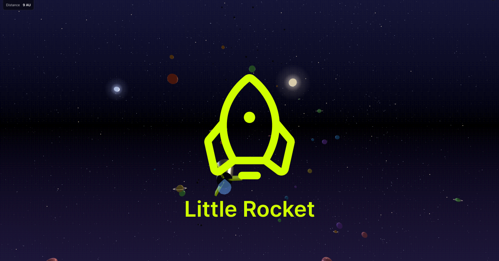

# Little Rocket

[](https://madebyhuman.iamjarl.com)

A tiny browser game where you fly a rocket through an endless field of procedurally placed planets. Built with [Three.js](https://threejs.org/) — no build step, no dependencies to install.



**Play it:** [littlerocket.iamjarl.com](https://littlerocket.iamjarl.com/) — desktop or laptop, keyboard required.

---

## Contents

1. [Controls](#controls)
2. [Run locally](#run-locally)
3. [Project structure](#project-structure)
4. [Architecture at a glance](#architecture-at-a-glance)
5. [Module responsibilities](#module-responsibilities)
6. [Tunable constants](#tunable-constants)
7. [Adding music](#adding-music)
8. [Editing the story](#editing-the-story)
9. [Design system](#design-system)
10. [Deployment](#deployment)
11. [Contributing](#contributing)

---

## Controls

| Key | Action |
|---|---|
| ↑ / ↓ | Pitch |
| ← / → or A / D | Yaw |
| Q / E | Roll |
| W / S | Throttle up / down |
| Mouse | Look around |
| ? button | Show controls hint |
| ♪ button | Toggle music *(visible only if loops are configured)* |

The HUD shows speed and distance traveled (in AU). A subtle **NEAR MISS** flash fires when you pass within 2.2× a planet's radius.

---

## Run locally

The project is plain static files, but ES module imports require a real `http://` origin — opening `index.html` straight from disk will not work.

```bash
npx serve .
# or
python3 -m http.server
```

Then open the URL the server prints.

There is **no build step**. Everything in the repo root is served as-is, both locally and on GitHub Pages. Three.js comes from `cdn.jsdelivr.net` via an import map in `index.html` — no `npm install` needed.

---

## Project structure

```
index.html                   Entry point + Three.js import map
favicon.png                  Browser tab icon
og-image.png                 Social preview (1200×630)
CNAME                        Generated by GitHub Pages when custom domain is set

styles/
  main.css                   UI chrome — references IAMJARL design tokens

vendor/
  iamjarl-tokens.css         Vendored copy of the design system tokens (v0.5.0)

src/
  main.js                    Game loop, intro, input wiring, scene orchestration
  scene.js                   Scene, lights, suns, starfields, nebulae, sky gradient
  rocket.js                  Rocket mesh + engine glow; reads --ij-color-primary
  planets.js                 Procedural planets, rings, moons, near-miss detection
  asteroids.js               Pool-shared low-poly asteroid clusters
  textures.js                Multi-octave value-noise bump + color textures
  exhaust.js                 Particle trail behind the rocket
  audio.js                   Procedural engine sound (Web Audio API)
  music.js                   Background music loop player (random selection)
  story.js                   Slow sci-fi narrative cycle
  controls.js                Keyboard + mouse input bridge
  motion.js                  prefers-reduced-motion gate

audio/                       Music loop MP3s go here (see audio/README.md)

scripts/
  check-tokens.sh            Verifies all --ij-* tokens exist in vendor file
```

---

## Architecture at a glance

```
                  ┌─────────────────────────────────────────┐
                  │            index.html                   │
                  │  importmap → three  /  loads main.js    │
                  └────────────────────┬────────────────────┘
                                       ▼
              ┌────────────────────────────────────────────────┐
              │                main.js                         │
              │  start() ─ click handler ─ initAudio()         │
              │  run()   ─ requestAnimationFrame loop          │
              │                                                │
              │   per frame:                                   │
              │    1. dt from THREE.Clock                      │
              │    2. intro phase override (1.6s) OR keys      │
              │    3. integrate position, FOV, glow, audio     │
              │    4. update camera (lerp + shake)             │
              │    5. update planets/asteroids/exhaust/etc.    │
              │    6. renderer.render(scene, camera)           │
              └─┬──────────┬──────────┬─────────┬──────────┬───┘
                ▼          ▼          ▼         ▼          ▼
            scene.js   rocket.js   planets.js  asteroids.js  exhaust.js
            (visuals)  (mesh)      (with near-miss)          (particles)

                        ▲           ▲
                        │           │
                  textures.js (shared bump/color noise)

           audio.js  music.js  story.js  motion.js  controls.js
           (engine)  (loops)   (text)    (a11y)     (input)
```

Two important conventions:

- **Followers**: anything that should feel infinitely far away (suns, nebulae, star layers, streak layer) re-pins to the rocket's position every frame. The player can fly forever without flying out of the surrounding sky. See `updateSuns`, `updateNebulae`, `updateStarAnchors` in `scene.js`.
- **Hot loop scratch**: per-frame Vector3 work uses scratch instances declared once in the closure (e.g. `forward`, `camTarget`, `enginePos` in `main.js`; `_scratch` in `planets.js` and `asteroids.js`). `.clone()` is avoided in the frame loop.

---

## Module responsibilities

| Module | What it owns | Key exports |
|---|---|---|
| `main.js` | Frame loop, intro state, input → speed/rotation, camera transform, HUD updates | _none — entrypoint_ |
| `scene.js` | Scene tree, lights, sky gradient, suns, star layers, streak layer, nebulae | `createScene`, `updateSuns`, `updateStreaks`, `updateNebulae`, `updateStarAnchors` |
| `rocket.js` | Rocket mesh group, engine glow material, runtime read of `--ij-color-primary` | `createRocket`, `updateGlow` |
| `planets.js` | Spawn/recycle planet groups with rings & moons, near-miss detection | `createPlanetField` |
| `asteroids.js` | Spawn/recycle asteroid clusters from a shared geometry pool | `createAsteroidField` |
| `textures.js` | Multi-octave noise → bump texture + color map, both shared | `getPlanetBumpTexture`, `getPlanetColorMap` |
| `exhaust.js` | Ring-buffer particle trail with additive fade | `createExhaust` |
| `audio.js` | Filtered noise + sub-osc engine drone, Web Audio API | `initAudio`, `setEngineLevel`, `suspendAudio` |
| `music.js` | Random loop selection over a list of MP3 paths, mute persistence | `startMusic`, `toggleMusic`, `isMuted`, `hasMusic` |
| `story.js` | Sentence-by-sentence narrative with fade in/out and looping | `startStory` |
| `controls.js` | Keyboard + mouse listeners, blur-resets all keys | `createControls` |
| `motion.js` | `prefers-reduced-motion` matchMedia gate, live-updates | `prefersReducedMotion` |
| `analytics.js` | Thin wrapper over Umami, with once-per-session helper | `trackEvent`, `trackOnce` |

---

## Tunable constants

The most useful knobs, organized by where they live. All are plain `const` declarations at the top of each module — no config file.

**Flight feel** (`main.js`)
- `ROT_SPEED` — radians per 60fps frame for pitch/yaw/roll
- `ACCEL`, `MAX_SPEED` — throttle curve
- `FOV_IDLE`, `FOV_MAX` — speed-based FOV punch range
- `INTRO_DURATION`, `INTRO_FOV_START`, `INTRO_CAM_DISTANCE` — opening cinematic

**World** (`planets.js`, `asteroids.js`)
- `TARGET_COUNT` (planets) — how many in flight at once
- `RING_CHANCE`, `ONE_MOON_CHANCE`, `TWO_MOON_CHANCE` — per-planet probabilities
- `FIELD_COUNT`, `ASTEROIDS_PER_FIELD`, `FIELD_RADIUS` — asteroid density

**Visuals** (`scene.js`, `textures.js`, `exhaust.js`)
- `SUNS` — array of sun specs (direction, color, intensity, halo size)
- `NEBULA_COLORS`, plus opacity range in `makeNebulae`
- `OCTAVES` — noise frequency bands for planet textures
- `POOL_SIZE`, `LIFETIME_S`, `SPAWN_RATE`, `SPAWN_THRESHOLD` — exhaust trail tuning

**Audio** (`audio.js`, `music.js`)
- `VOLUME` (in `music.js`) — music loop volume, defaults to 0.4
- `setEngineLevel` ramp constants in `audio.js` — engine timbre and gain

---

## Adding music

Music is opt-in and not in the repo. To add loops:

1. Drop MP3 files in `audio/` (e.g. `audio/loop-cosmic-drift.mp3`)
2. Add their paths to the `LOOPS` array in `src/music.js`:
   ```js
   const LOOPS = [
     'audio/loop-cosmic-drift.mp3',
     'audio/loop-deep-space.mp3',
   ];
   ```
3. The ♪ button auto-appears in the top-right HUD. Mute state persists in localStorage.

When a loop ends, the player picks another at random (never the one that just played, when there are 2+). See `audio/README.md` for format/length/loudness recommendations.

---

## Editing the story

Edit `SENTENCES` in `src/story.js`. Each sentence fades in over `FADE_MS`, holds for `HOLD_MS`, fades out, and waits `GAP_MS` before the next. The narrative loops indefinitely once it starts (after the cinematic intro completes).

Keep lines short — they should be readable at a glance from the bottom of the screen while the player is steering.

---

## Design system

The UI chrome (start screen, button, HUD, story copy) uses tokens from [iamjarl-design](https://github.com/JarlLyng/iamjarl-design). The 3D scene has its own visual language and does not reference design tokens.

The page is anchored to dark mode (`<html class="dark">`) so token values stay consistent regardless of the visitor's OS preference — the space scene is always dark, so light-mode tokens would clash.

The rocket's fin color is a special case: `rocket.js` reads `--ij-color-primary` at runtime via `getComputedStyle()`, so brand color changes flow through to the 3D scene without code changes.

### Updating tokens

The design system is vendored, not linked. To pull a new release, copy the latest `dist/css/tokens.css` from the design-system repo into `vendor/iamjarl-tokens.css`, then run the validator:

```bash
./scripts/check-tokens.sh
```

The script verifies that every `--ij-*` token referenced in our CSS still exists in the vendored file. If upstream renamed or removed a token we depend on, the script fails with a list of missing tokens — preventing silent fallback to hardcoded values.

---

## Deployment

Hosted on GitHub Pages with the custom domain `littlerocket.iamjarl.com`. There is no build step — everything in the repo root is served as-is.

GitHub Pages re-deploys on every push to `main`. Cache-Control is set to 10 minutes, so test changes with a hard refresh (Cmd/Ctrl+Shift+R) if they appear missing.

### Analytics

Pageview counts and a small set of engagement events go to a self-hosted [Umami](https://umami.is) instance at `umami-iamjarl.vercel.app`. No cookies, no IP storage, no cross-site tracking. The script tag lives in `index.html`; the events are sent from `src/analytics.js`.

Tracked events:

| Event | When | Properties |
|---|---|---|
| `game-started` | First click of Start, once per session | – |
| `max-speed` | First time speed reaches MAX_SPEED, once per session | `{ distance }` |
| `first-near-miss` | First NEAR MISS trigger, once per session | `{ distance }` |
| `music-mute` / `music-unmute` | Each click on the ♪ button | – |

Distances are integer AU. Nothing user-identifying is sent. Remove the Umami script tag (or fork without it) if you'd rather not be counted.

---

## Contributing

This is a personal project, but issues and pull requests are welcome. See [CONTRIBUTING.md](CONTRIBUTING.md) for the short version: keep it modular, tune via the constants table above, run `./scripts/check-tokens.sh` after touching tokens, and prefer additive changes over rewrites.

---

## License

[MIT](LICENSE)
